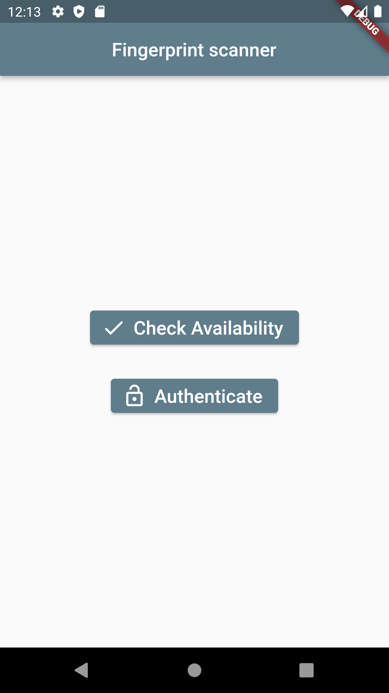
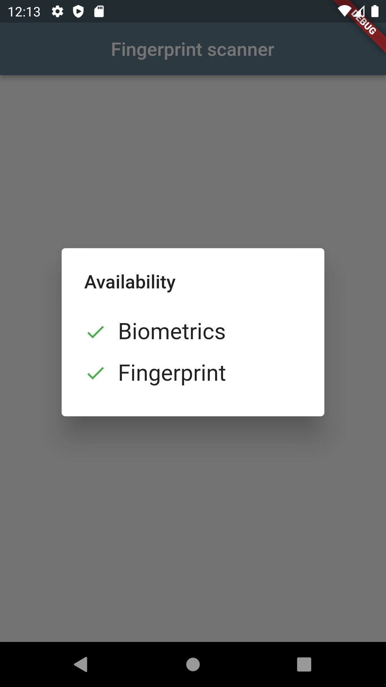
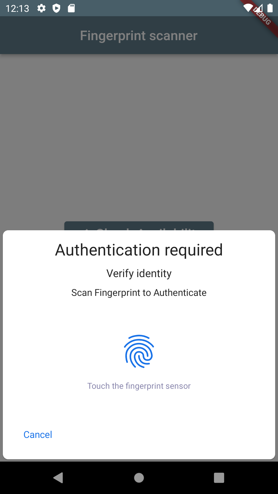
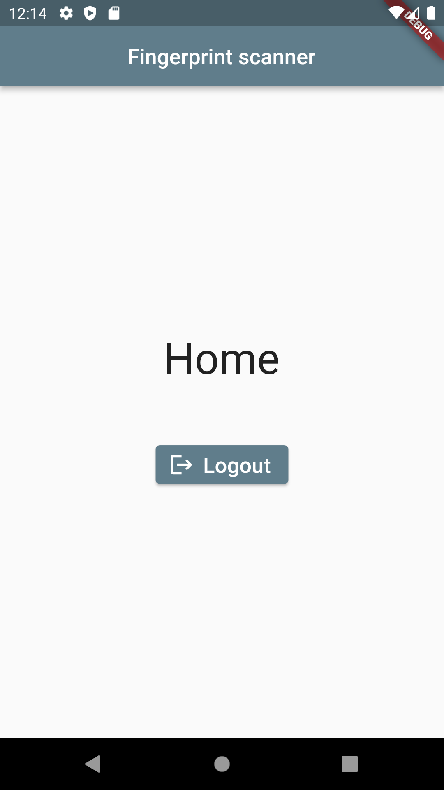

# bioscan

Android fingerprint scanner.

## Getting Started
### Prerequisites
* [Flutter](https://docs.flutter.dev/get-started/install)
#### For Android
* [Android Studio](https://developer.android.com/studio)

### Build
* Create and open an [Android Virtual Device (AVD)](https://developer.android.com/studio/run/managing-avds) in Android Studio.
* Build and run the project using the following command:
```
flutter run
```
* Or use vscode [flutter](https://marketplace.visualstudio.com/items?itemName=Dart-Code.flutter) extension.

This project is a starting point for a Flutter application.

## Output
### Before scanning the fingerprint


* Check availability\


* Authenticate\


### After scanning the fingerprint


## Flutter resources
A few resources to get you started if this is your first Flutter project:

- [Lab: Write your first Flutter app](https://flutter.dev/docs/get-started/codelab)
- [Cookbook: Useful Flutter samples](https://flutter.dev/docs/cookbook)

For help getting started with Flutter, view our
[online documentation](https://flutter.dev/docs), which offers tutorials,
samples, guidance on mobile development, and a full API reference.